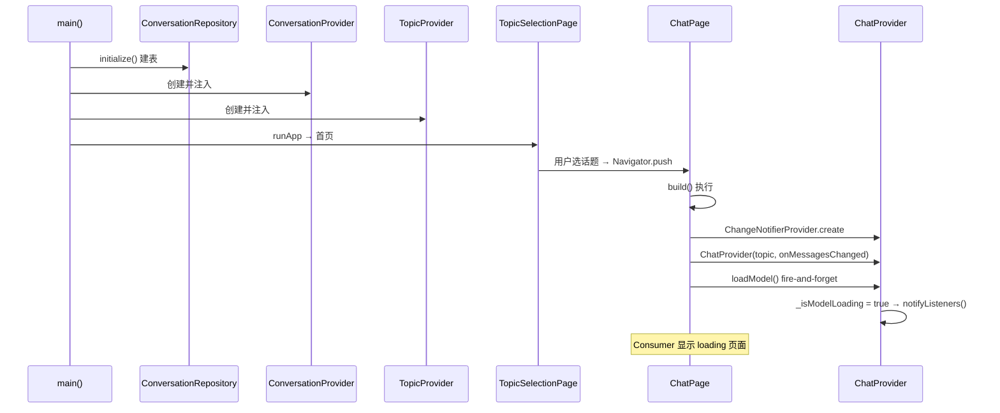
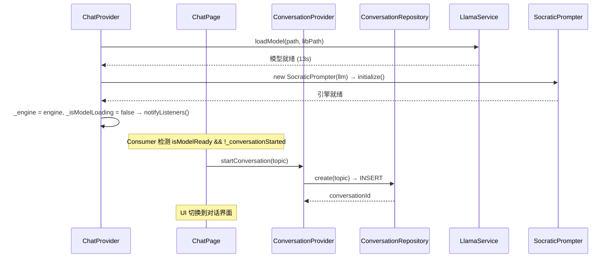
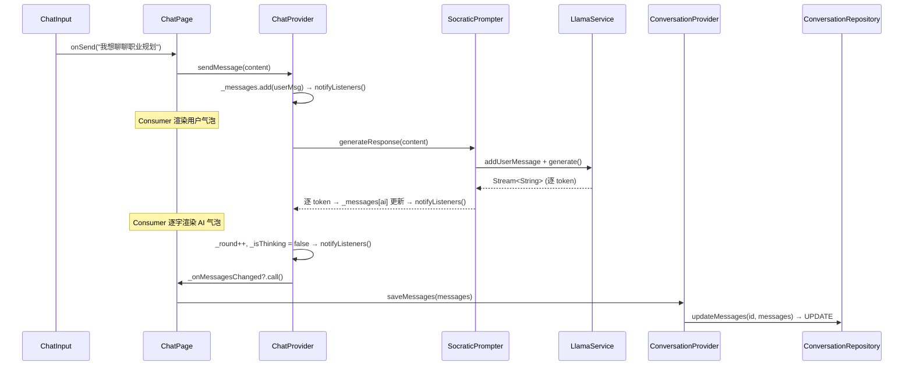
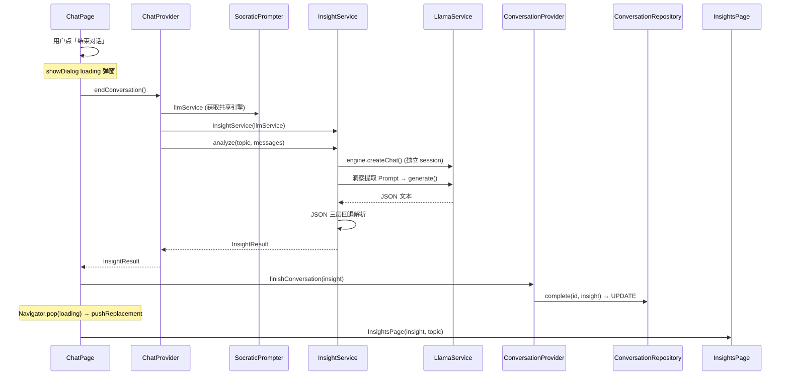
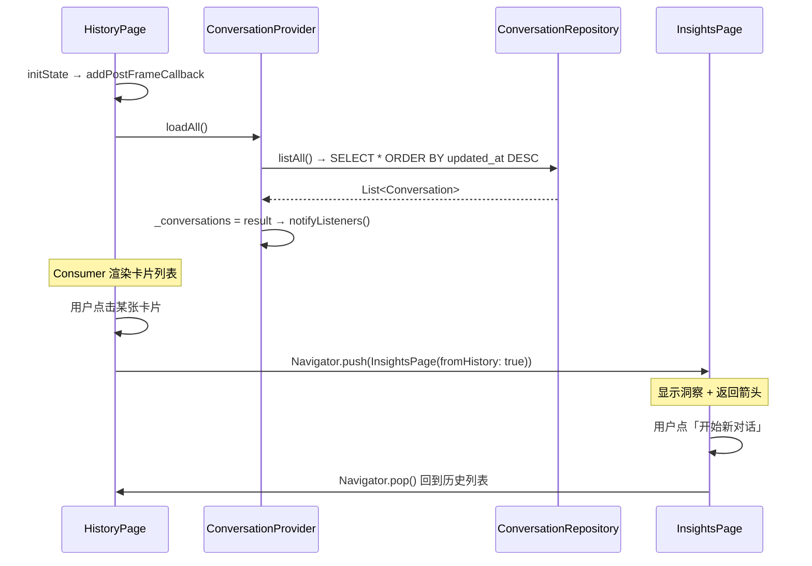

# Flutter State / Widget / Provider — 核心概念笔记

> 2026-07-07 基于 socratic-ai 项目实践整理。

---

## 一、Widget 与 State 的关系

```
StatelessWidget — 没有 State，纯展示，数据变了就整个 Widget 重建
StatefulWidget — 有 State，Widget 是不可变的"身份证"，State 是"本人"，存数据 + build()
```

| 概念 | 职责 | 可变？ |
|:--|------|:--:|
| Widget | 携带参数、标识自己、`createState()` | 不可变 |
| State | 存数据、`build()` UI、生命周期（initState/dispose） | 可变 |
| Element | 粘合层——Widget 可以换，Element 不走，State 就不丢 | 框架内部维护 |

**日常数据更新只重跑 `build()`，不重建 Widget。** Widget 只在旋转屏幕、热重载、父级重建时才重新创建。

---

## 二、State 与 Provider 的职责划分

| | State | Provider |
|:--|------|------|
| **管什么** | 这一个页面的局部 UI 状态 | 跨页面共享的业务数据 |
| **谁能访问** | 只有这个页面自己 | 整个 App 任何页面 |
| **生命周期** | 页面离开就销毁 | App 关闭才销毁 |

**判断标准**：这个数据，其他页面需要吗？需要 → Provider；不需要 → State。

---

## 三、Provider 的创建与交互

### 3.1 核心类型

| Provider | 职责 | 创建时机 |
|:--|------|------|
| `TopicProvider` | 管理话题选择状态 | `main()` 注入，全局 |
| `ConversationProvider` | 活跃会话生命周期 + 历史列表管理 | `main()` 注入，全局 |
| `ChatProvider` | 模型加载 + 对话 + 洞察 + 持久化回调 | ChatPage 进入时创建，离开时销毁 |

### 3.2 跨 Provider 通信

ChatProvider 需要通知 ConversationProvider 保存消息，但两者不直接依赖——通过 **ChatPage 作为协调者**，以回调注入的方式桥接：

```
ChatPage
  ├── 创建 ChatProvider(onMessagesChanged: () => convProvider.saveMessages(...))
  ├── 读取 ConversationProvider.startConversation / finishConversation
  └── 协调 ChatProvider.endConversation() → ConversationProvider.finishConversation()
```

**原则**：Page 层是胶水，Provider 之间不互相调用。

---

## 四、项目 Provider 交互时序图

### 4.1 App 启动 → 进入对话页



### 4.2 模型加载完成 → 开始对话



### 4.3 用户发送消息



### 4.4 结束对话 → 洞察总结



### 4.5 历史列表查看



---

## 五、关键设计决策

### 5.1 为什么 ChatProvider 不全局注入？

ChatProvider 管理的是一次对话的临时状态——离开 ChatPage 就销毁。全局注入会导致：
- 上一轮对话的消息残留在内存
- 两个 ChatPage 实例（如果未来有）互相干扰
- 内存无法及时释放

### 5.2 为什么 ConversationProvider 全局注入？

因为它管理的是所有对话的历史记录——HistoryPage 需要，ChatPage 也需要（创建/保存/完成），InsightsPage 不需要但未来可能。全局注入让任何页面都能读写会话数据库。

### 5.3 为什么用回调注入而不是 Provider 互相依赖？

```dart
// ❌ ChatProvider 直接依赖 ConversationProvider
class ChatProvider {
  final ConversationProvider _convProvider;
  // 测试时要 mock 两个 Provider，耦合度高
}

// ✅ ChatProvider 只接收回调，不关心谁提供
class ChatProvider {
  final VoidCallback? _onMessagesChanged;
  // 测试时传 () {} 即可，解耦彻底
}
```

回调是「你通知我，但我不关心你」——ChatProvider 只需要一个「消息变了告诉外面」的通道，不需要知道这个通道最终通向 ConversationProvider 还是其他什么。

---

## 六、耦合类型分析：Page 层做"胶水"的理由

### 6.1 三种耦合

| 类型 | 写法 | 可测试？ | 示例 |
|:--|------|:--:|------|
| **A：实现层耦合** | `class ChatProvider { final repo = ConversationRepository(); }` | ❌ | Provider 内部 hardcode 具体实现 |
| **B：接口层耦合** | `class ChatProvider { final ConversationProvider _cp; }` | ⚠️ | Provider 依赖另一个 Provider 的接口 |
| **C：接线层耦合** | `Page 里 convProvider.saveMessages` 接到 `ChatProvider` 的回调 | ✅ | 依赖双方独立，只在 Page 里绑定 |

项目的选择是 **C**：ChatProvider 不依赖任何 Provider，ConversationProvider 也不依赖任何 Provider。ChatPage 是唯一知道"两者怎么配合"的地方。

### 6.2 同样是 Type B，放不同的层后果完全不同

```
如果 ChatProvider 依赖 ConversationProvider：
  ChatProvider ──依赖──→ ConversationProvider
       ↑                      ↑
   "对话逻辑"              "存储逻辑"

  问题：两个 Provider 绑死了。
  → 换存储方案（sqflite → 网络 API）？改 ChatProvider。
  → 测试 ChatProvider？必须 mock ConversationProvider（mock 一堆方法）。
  → ChatProvider 的职责是「管理对话」，它不应该关心「消息存哪了」。


如果 ChatPage 同时依赖两者：
  ChatPage
   ├── 依赖 ChatProvider.onMessagesChanged（一个 VoidCallback）
   └── 依赖 ConversationProvider.saveMessages（一个方法）

  → 换存储方案？只改 ChatPage 的接线部分，ChatProvider 完全不动。
  → 测试 ChatProvider？不需要 mock，回调传 () {} 即可。
  → 职责清晰：ChatProvider = 对话引擎，ChatPage = 组装者。
```

### 6.3 类比：灯泡、开关、接线盒

```
Provider = 灯泡、开关（通用零件）
  → ChatProvider = "有电就亮，亮的时候通知外面一声"
  → ConversationProvider = "谁跟我说存东西我就存"

Page     = 墙上的接线盒（特定房间的组装方案）
  → ChatPage = "这间房里，灯泡亮了通知开关，开关按了存数据库"

灯泡不应该知道开关的存在。开关也不应该知道灯泡的存在。
接线盒把它们接到一起——这就是它的工作。
```

### 6.4 Page 层做 Type B 耦合更合适的本质原因

不是因为 Type B 本身变了，而是**发生耦合的位置决定了它是不是"污染"**：

```
Provider 层做 Type B  →  污染了可复用组件
                          Provider 应该是独立的业务单元，不应该绑定到另一个 Provider

Page 层做 Type B      →  正常的组装职责
                          Page 天然就是多 Provider 的协调点
                          它的生命周期就是"这个场景里的东西怎么配合"
```

Page 被设计为"一次性组装上下文"——离开这个场景它就不存在了。Provider 被设计为"被组装的部件"——换上不同的 Page，同一个 Provider 应该还能用。把依赖关系放在组装者（Page）身上，被组装者（Provider）保持独立，这就是「接线层耦合」优于「接口层耦合」的核心原因。

